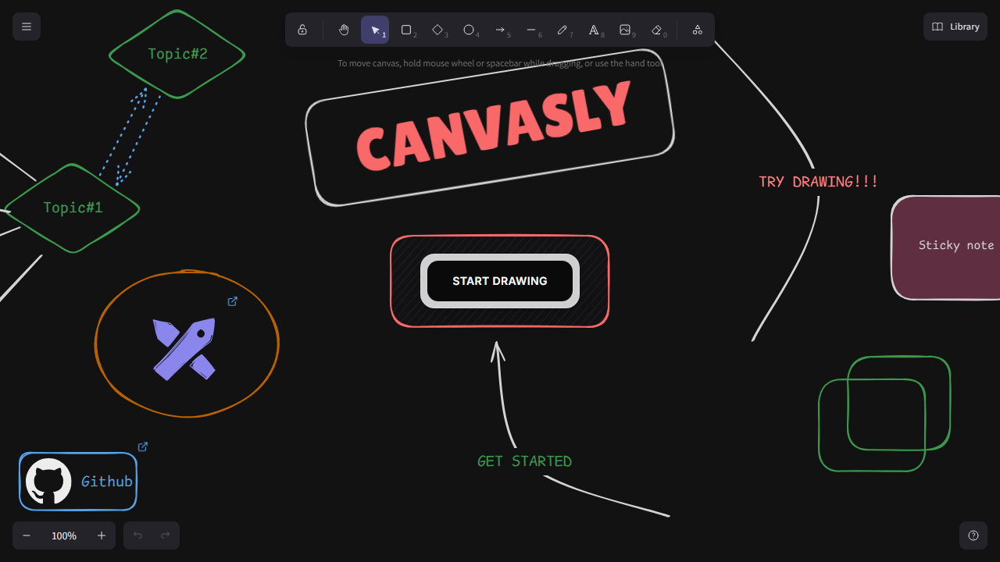

# Canvasly

Canvasly is a real-time collaborative canvas application built with Next.js, Excalidraw, Convex, and PartyKit (Cloudflare Durable Objects). Users can create, edit, and share diagrams, sketches, and ideas with live synchronization across browsers.

The app is deployed at https://canvas.snowfluff.online/

## Screenshots

### Landing Page



## Tech Stack

- **Frontend**: Next.js 16, React 19, TypeScript, Tailwind CSS 4
- **UI Components**: Base UI, shadcn/ui style components, Lucide React icons
- **Whiteboard**: Excalidraw (@excalidraw/excalidraw)
- **Database & Backend**: Convex
- **Real-time Sync**: PartyKit (Cloudflare Durable Objects) via partyserver/partysocket
- **Authentication**: Clerk
- **Styling**: Tailwind CSS 4, class-variance-authority (CVA), next-themes for dark mode

## Key Features

- **Excalidraw Canvas Editor**: Full-featured drawing canvas with shapes, arrows, text, and freehand drawing.
- **Real-time Collaboration**: Canvas edits sync across connected clients using PartyKit WebSockets. Each canvas room is backed by a Cloudflare Durable Object that persists elements and broadcasts updates.
- **Canvas Management**: Users can create, rename, favorite, and delete canvases. Canvases are listed on a dashboard with filtering (All / Starred).
- **Sharing**: Each canvas can be shared via a time-limited link (valid for one week). Anyone with the link can view the canvas without authentication.
- **Dark Mode**: Theme toggle with system preference detection and keyboard shortcut (Ctrl/Cmd + D).

## Project Structure

- `app/` - Next.js App Router pages and layouts
  - `page.tsx` - Landing page with embedded Excalidraw showcase
  - `dashboard/` - User dashboard with canvas list, filters, and actions
  - `canvas/[canvasId]/` - Live canvas editor page
  - `share/[shareId]/` - Public share view for read-only canvas access
  - `layout.tsx` - Root layout with providers (Convex, Clerk, Theme, Tooltip, Toast)
  - `globals.css` - Tailwind 4 theme configuration (light/dark)
- `components/`
  - `ui/` - Reusable UI primitives (button, dialog, toast, tooltip, skeleton, loading, hint, alert-dialog)
  - `theme-provider.tsx` - Theme context provider with dark/light toggle
- `providers/convex-client-provider.tsx` - Convex + Clerk integration
- `convex/` - Convex backend functions
  - `canvases.ts` - Queries for listing user/org canvases with favorites
  - `canvas.ts` - Mutations/queries for CRUD, name updates, image updates, favorites, touch (last accessed)
  - `share.ts` - Create/get share links with expiration
  - `schema.ts` - Database schema (canvases, userCanvasFavorites, shares)
  - `auth.config.js` - Clerk auth configuration for Convex
- `lib/`
  - `env.ts` - Environment variable validation with Zod
  - `party.ts` - Helper to fetch canvas elements from PartyKit server
  - `utils.ts` - Utility functions (cn, getTimeAgo, oneWeekFromNow)
- `party/index.ts` - PartyKit server implementation (CanvasServer Durable Object)
- `hooks/useApiMutation.ts` - Wrapper around Convex useMutation with pending state

## Environment Variables

Required environment variables (see `lib/env.ts`):

```
CONVEX_DEPLOYMENT=
CLERK_SECRET_KEY=
NEXT_PUBLIC_CONVEX_URL=
NEXT_PUBLIC_CONVEX_SITE_URL=
NEXT_PUBLIC_CLERK_PUBLISHABLE_KEY=
NEXT_PUBLIC_PARTY_HOST=
```

## Getting Started

1. Install dependencies:
   ```bash
   npm install
   ```

2. Copy `.env.local.example` to `.env.local` (or set the environment variables directly) and fill in the values from your Convex and Clerk dashboards, plus your PartyKit host.

3. Run the development server:
   ```bash
   npm run dev
   ```

4. Open http://localhost:3000

5. Build for production:
   ```bash
   npm run build
   npm start
   ```

## Deployment

The app is designed to be deployed on a platform that supports Next.js (e.g., Vercel). Convex and PartyKit are used as managed services, so their URLs/keys must be set in the deployment environment.

## Additional Files

- `convex/README.md` - Generic Convex functions documentation (auto-generated scaffolding)
- `convex/auth.config.js` - Clerk auth config for Convex
- `convex/tsconfig.json` - TypeScript config for Convex functions
- `convex/schema.ts` - Database schema definition
- `convex/canvases.ts` - Canvas listing queries
- `convex/canvas.ts` - Canvas CRUD and mutations
- `convex/share.ts` - Share link creation and retrieval
- `lib/env.ts` - Environment variable schema
- `lib/party.ts` - PartyKit client helper
- `lib/utils.ts` - Utility functions
- `party/index.ts` - PartyKit Durable Object server
- `hooks/useApiMutation.ts` - API mutation hook with pending state
- `components/ui/*` - UI component implementations
- `components/theme-provider.tsx` - Theme provider with dark mode hotkey
- `providers/convex-client-provider.tsx` - Convex + Clerk provider setup
- `app/layout.tsx` - Root layout with all providers
- `app/globals.css` - Global styles and Tailwind 4 theme
- `app/types.ts` - Shared types for canvas messages and elements
- `app/page.tsx` - Landing page
- `app/dashboard/page.tsx` - Dashboard page
- `app/dashboard/_components/*` - Dashboard components (NavHeader, CanvasPreview, CanvasSelection, Filters, AddCanvas, ShareCanvas, CanvasPreviewSkeleton)
- `app/canvas/[canvasId]/page.tsx` - Canvas editor page
- `app/canvas/[canvasId]/_components/CanvasRoom.tsx` - Canvas room wrapper
- `app/canvas/[canvasId]/_components/CanvasEditor.tsx` - Excalidraw editor with real-time sync
- `app/share/[shareId]/page.tsx` - Share view page
- `app/loaders.tsx` - Loading component
- `app/loading.tsx` - Loading page component
- `public/landing.excalidraw` - Landing page Excalidraw scene
- `public/logo.svg` - Logo
- `public/screenshot-home.png` - Screenshot of the landing page

## Notes

- The landing page embeds an Excalidraw scene from `public/landing.excalidraw` and scrolls to a target element on load.
- Share links expire after one week (configurable via `lib/utils.ts` -> `oneWeekFromNow()`).
- Canvas elements are persisted in PartyKit Durable Objects per canvas room, and also synced to Convex for metadata (name, imageUrl, updatedAt, favorites).
- The dashboard requires authentication; share routes are publicly accessible.
- The project uses npx tsx for running TypeScript files directly (e.g., screenshot generation script in tests/screenshot.ts).
- Screenshot captured via Playwright and stored at `public/screenshot-home.png`.

